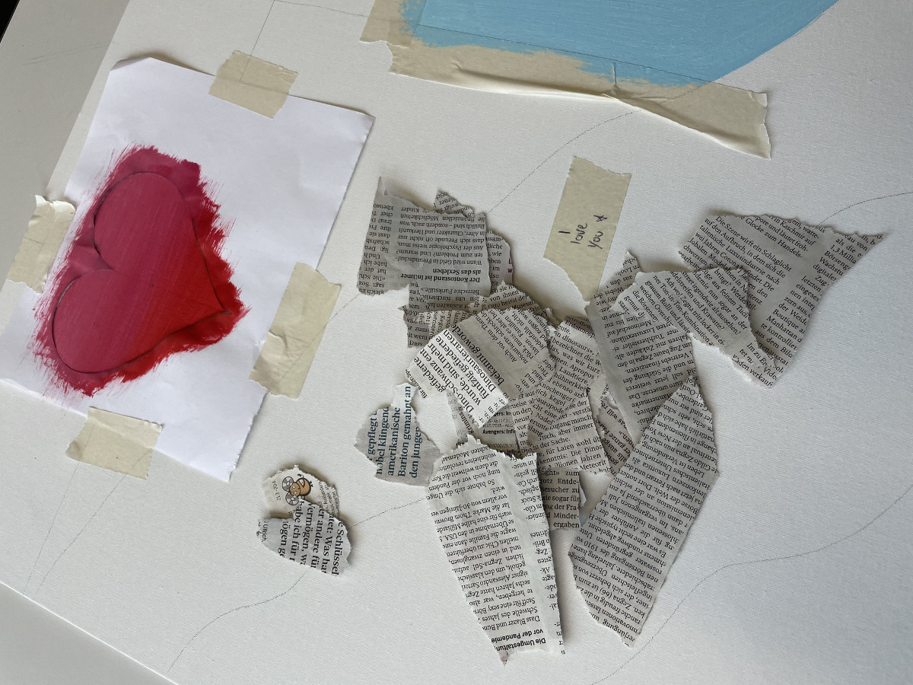
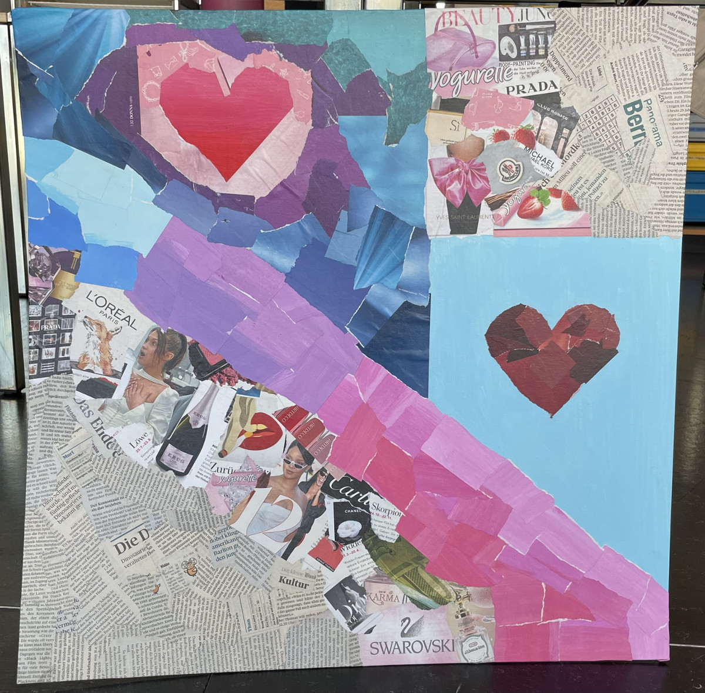

+++
title = "Fantasien der Collagen"
date = "2022-03-29"
draft = false
pinned = false
tags = ["Blog", "Collage", "Art"]
image = "collage.webp"
footnotes = "[Kunst: Überblick Collage - Die Collage in der Kunstgeschichte (friedrich-verlag.de)](https://www.friedrich-verlag.de/kunst/historische-kunst/ueberblick-collage-4748)\n\nDulapeep2"
+++
> # ***Projekt der Collage***

## **Collagen**

Collagen umfassen ein grossen Teil der Kunst. Unter Collage stellt im wörtlichen Sinn ein Klebebild dar. Die Collagen tauchen in vielen verschiedenen Formen und Variationen auf. Man kann viele verschiedene Techniken verwenden und ist bei der Gestaltung relativ frei. Es können verschiedene Materialien wie Bilder, Texte, Zeitungen, plastische Objekte etc. auf einer Unterlage fixiert werden. Aus Elementen entsteht als Endprodukt ein neues Ganzes gestalterisches Bild.

## **Selbständige Arbeit**

Von Anfang an war klar, dass ich eine Collage machen möchte. Schon als Kind habe ich oft Collagen gemacht. Bei den Collagen kann man seine ganzen Gedanken und Emotionen in ein Bild packen. Ich habe schon viele verschiedene Collagentechniken ausprobiert und wollte bei meiner eigenen Arbeit mich nicht einschränken. Aus diesem Grund habe ich all meine Ideen in ein gesamtes Bild gepackt. 

##### **Ideen und Gedanken**

Meine Arbeit soll mich und meine Präferenzen widerspiegeln. Ich wollte verschieden Techniken einbeziehen und ich habe meine Lieblingsfarben verwendet. Zudem habe ich mich auch an dem Herzmotiv orientiert. Meine Vorstellung habe ich zuerst skizziert. Jedoch ist das Endprodukt doch anders herausgekommen.

Techniken:

* Zeitung
* Kataloge
* Selbstkreierung meiner Farben 
* Bilder
* Acrylfarbe

Die Bilder welche ich genommen habe entsprechen den Dingen, die ich mag. Auch bei den Zeitungsartikeln sind paar Wörter zusehen, welche aus Prinzip auf meiner Collage sind. 

##### Prozess

Meine Collage kam auf eine grosse Leinwand. Ich startete mit den Vorarbeiten (Malen mit Acryl auf Leinwand / Farbe auf Papier für Collage). Ich begann mit der ersten Collagenphase und arbeitete mich durch jede Phase durch. Während der ganzen Arbeit habe ich für das aufkleben der einzelnen Collagenelemente Fischkleister verwendet. Gegen Ende war ich mit meiner Anfangsidee nicht mehr zufrieden und habe sie perfekt angepasst. Aus den einzelnen Phasen wurde dann schlussendlich ein Verlauf besser gesagt eine Wiederholung der Technik.

## **Endprodukt und Hintergrund**

Meine Collage ist viel mehr als nur ein einfaches Bild. In der Collage stecken viele verschieden Überlegungen/Vorlieben/Gedanken. Bei meiner Collage habe ich meiner Fantasie freien Lauf gelassen. Sie drückt mich aus. Es ist nicht irgendeine Collage sondern es ist eine Collage welche spezifisch auf mich Zutrifft. In ihr steckt volle Kreativität. 

Es ist nicht nur das Bild welches zählt, sondern das gesamte mit all seinen Eindrücken und Intentionen. Bei meiner selbständigen Arbeit ging es um Spass und man konnte seine eigene Ideen ausdrücken auf der Leinwand.

Auf dem Endprodukt habe ich zwei Mal mit Zeitung und Katalogbildern gearbeitet. In der Mitte wird das Herzmotiv auch zwei Mal auf verschiedene Arten wiedergegeben. Einmal mit roter Farbe und um das Herz mit meinen drei ausgesuchten Farben collagiert und einmal wurde das Herz collagiert. Nebst dem Herzmotiv ist in der Mitte die Collagenphase, bei der ich die Farben selbst aufs Papier gebracht habe und sie danach in verschieden Teile aufgeteilt, sodass es zu einer Collage wurde. 

Ich habe mein Ziel von meiner selbstständigen Arbeit definitiv erreicht.

